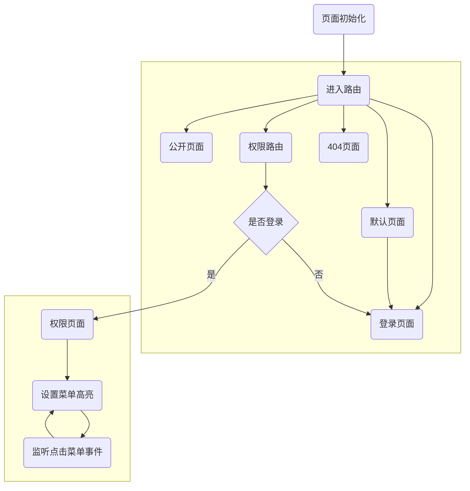

### 登录代码流程



### 登录业务流程
```flow
st=>start: 页面初始化
getUserInfo=>operation: 获取用户信息
isLogin=>condition: 是否登陆?
showPage=>end: 显示页面
goLogin=>end: 跳转到登陆页面


st->getUserInfo->isLogin
isLogin(yes)->showPage
isLogin(no)->goLogin

```